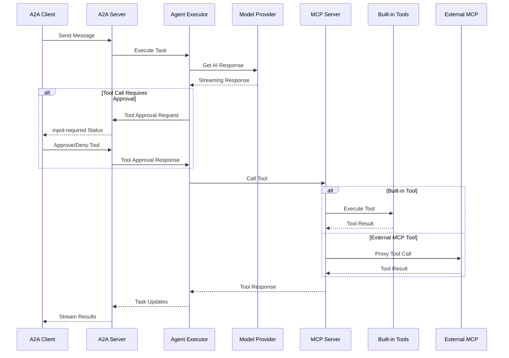

# Timestep AI Engine

A TypeScript library and CLI for building AI agent systems with A2A (Agent-to-Agent) protocol and MCP (Model Context Protocol) support.

**Note:** The TypeScript implementation is in progress and ready to use, but consider it alpha. A Python version is coming soon! If you're interested in the Python implementation, please leave a note on [GitHub Issue #135](https://github.com/Timestep-AI/timestep/issues/135).

Timestep addresses discrepancies between OpenAI's Agents SDK Python and TypeScript libraries, providing a unified system for tool-calling, long-term state management, and third-party model integration (including working Ollama support).

**Free & Open Source** - MIT licensed. See [LICENSE](LICENSE) for details.

This library powers [Timestep AI](https://timestep.ai) - the open core for our upcoming public platform focused on personal AI control with a default multi-agent assistant system.

## Quick Start

```bash
# Install globally
npm install --global @timestep-ai/timestep

# Start server
timestep server

# Chat with agents
timestep chat
```

## What's Inside

- **A2A Protocol** - Agent-to-Agent communication with streaming support
- **OpenAI Agents SDK** - Built on OpenAI's Agents SDK with unified Python/TypeScript compatibility
- **Human-in-the-Loop** - Default approval for every tool call with fine-grained control - step back as you gain comfort
- **MCP Integration** - Built-in tools + easy connection to any MCP server (Rube, Beeper Desktop, etc.)
- **Multi-Runtime** - Works in Node.js, Deno, and Supabase Edge Functions
- **Flexible Storage** - Default JSONL files, overrideable with custom repositories (PostgreSQL, etc.)
- **CLI Interface** - Terminal UI for agent interaction
- **API Server** - RESTful endpoints for programmatic access
- **Your API Keys** - Add your own API keys for any model provider to power your agents
- **Chat App Integration** - Connect to [Rube](https://rube.app/) and [Beeper Desktop](https://developers.beeper.com/desktop-api/mcp) for access to all your messaging apps

## Architecture



## Components

- **TypeScript Library** - Core agent system (`typescript/timestep/`)
- **A2A Inspector** - Debug tool for agent communication (`bash/a2a-inspector/`)

## Storage

By default, Timestep uses JSONL files for storage (`~/.config/timestep/`). You can override this with custom repositories - see `typescript/timestep/examples/supabase-edge-function.ts` for a complete PostgreSQL/Supabase implementation.

See `typescript/timestep/README.md` for detailed documentation.
