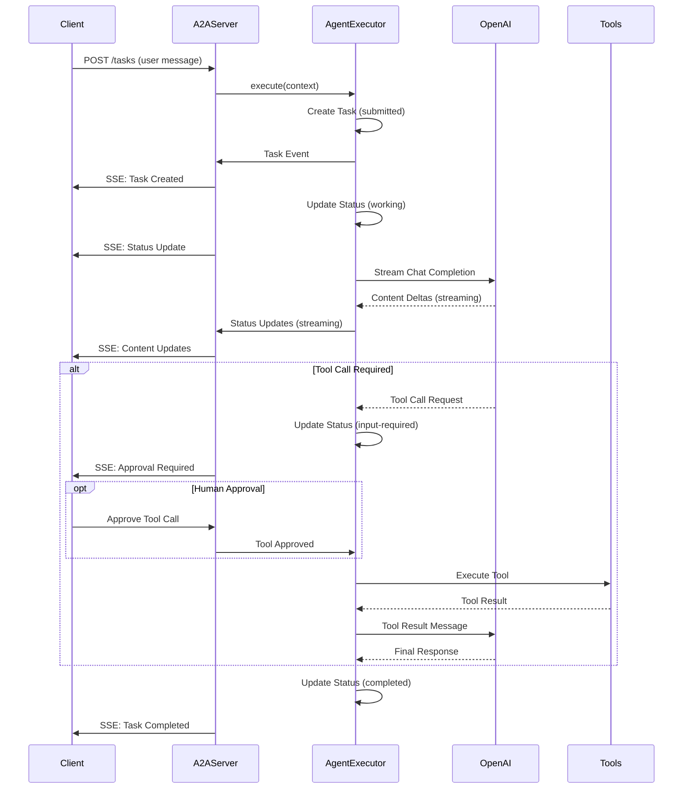

# Timestep

Streaming agent implementation using OpenAI's streaming API with tool support. Available in both Python and TypeScript.

## What is Timestep?

Timestep is a library and server framework for building AI agents. You can use it in two ways:

1. **As a Library** - Import `run_agent` in your code to create conversational agents with tool support
2. **As an A2A Server** - Run a standalone server that exposes your agent via the [A2A Protocol](https://a2a-protocol.org/) for agent-to-agent communication

## Architecture Overview

Timestep provides a streaming agent framework that integrates OpenAI's API with tool execution capabilities. The system follows the A2A Protocol's "Task-generating Agents" philosophy, where all interactions are modeled as tasks with well-defined states and lifecycle.

### Core Components

- **Agent Core** (`run_agent`): Handles streaming conversations with OpenAI, tool execution, and conversation context management
- **A2A Server**: Exposes agents via HTTP endpoints following the A2A Protocol specification
- **Tool System**: Extensible tool framework supporting custom tools with approval workflows
- **Event Streaming**: Real-time task updates via Server-Sent Events (SSE)

## Sequence Diagram

The following diagram shows the flow of a typical agent interaction:


```mermaid
sequenceDiagram
    participant Client
    participant A2AServer
    participant AgentExecutor
    participant OpenAI
    participant Tools

    Client->>A2AServer: POST /tasks (user message)
    A2AServer->>AgentExecutor: execute(context)
    
    AgentExecutor->>AgentExecutor: Create Task (submitted)
    AgentExecutor->>A2AServer: Task Event
    A2AServer->>Client: SSE: Task Created
    
    AgentExecutor->>AgentExecutor: Update Status (working)
    A2AServer->>Client: SSE: Status Update
    
    AgentExecutor->>OpenAI: Stream Chat Completion
    OpenAI-->>AgentExecutor: Content Deltas (streaming)
    AgentExecutor->>A2AServer: Status Updates (streaming)
    A2AServer->>Client: SSE: Content Updates
    
    alt Tool Call Required
        OpenAI-->>AgentExecutor: Tool Call Request
        AgentExecutor->>AgentExecutor: Update Status (input-required)
        A2AServer->>Client: SSE: Approval Required
        
        opt Human Approval
            Client->>A2AServer: Approve Tool Call
            A2AServer->>AgentExecutor: Tool Approved
        end
        
        AgentExecutor->>Tools: Execute Tool
        Tools-->>AgentExecutor: Tool Result
        AgentExecutor->>OpenAI: Tool Result Message
        OpenAI-->>AgentExecutor: Final Response
    end
    
    AgentExecutor->>AgentExecutor: Update Status (completed)
    A2AServer->>Client: SSE: Task Completed
```

## Task State Machine

Tasks progress through the following states:

```mermaid
stateDiagram-v2
    [*] --> submitted: User sends message
    submitted --> working: Agent starts processing
    working --> input-required: Tool approval needed
    working --> completed: Response ready
    working --> failed: Error occurred
    input-required --> working: Tool approved
    input-required --> failed: Tool rejected/error
    working --> canceled: User cancels
    input-required --> canceled: User cancels
    completed --> [*]
    failed --> [*]
    canceled --> [*]
```

**State Descriptions:**

- **submitted**: Initial state when a task is created
- **working**: Agent is processing the request (streaming content or executing tools)
- **input-required**: Human approval is needed for a tool call
- **completed**: Task finished successfully with final response
- **failed**: Task encountered an error
- **canceled**: Task was canceled by the user

## Quick Start

### Using as a Library

See the language-specific documentation for detailed usage:
- [Python Documentation](./python/README.md) - Installation and library usage
- [TypeScript Documentation](./typescript/README.md) - Installation and library usage

### Running the A2A Server

See the language-specific documentation for detailed server setup:
- [Python A2A Server](./python/README.md#running-the-a2a-server) - Python server setup
- [TypeScript A2A Server](./typescript/README.md#running-the-a2a-server) - TypeScript server setup

**Default Configuration:**
- Host: `0.0.0.0`
- Port: `8080`
- Model: `gpt-4.1`

Once running, the server exposes:
- **Agent Card**: `http://localhost:8080/.well-known/agent-card.json`
- **Task Endpoint**: `POST /tasks` to create tasks
- **Streaming**: `GET /tasks/{task_id}/stream` for SSE updates

## Features

- **Streaming**: Uses OpenAI's streaming API for real-time responses
- **Tool Support**: Extensible tool framework with custom tool support
- **Conversation Context**: Maintains conversation history through message arrays
- **Tool Approval**: Optional callback for human-in-the-loop tool approval
- **Cross-Language**: Equivalent implementations in Python and TypeScript
- **A2A Protocol**: Full support for the [Agent2Agent (A2A) Protocol](https://a2a-protocol.org/) for agent-to-agent communication
- **Task Lifecycle**: Well-defined task states with streaming status updates
- **Agent Discovery**: Agent Card exposes capabilities and skills for discovery

## A2A Protocol Support

Timestep implements the A2A Protocol, enabling your agent to communicate with other A2A-compatible agents and systems. The implementation follows the "Task-generating Agents" philosophy, where all interactions are modeled as tasks.

### Key A2A Features

- **Task-generating Agents**: All agent responses are encapsulated in `Task` objects
- **Human-in-the-loop**: Tool calls can require approval using the `input-required` task status
- **Streaming Updates**: Real-time task status updates via Server-Sent Events (SSE)
- **Agent Skills**: Tools are automatically exposed as `AgentSkill` objects in the Agent Card
- **Agent Card**: Discoverable agent metadata at `/.well-known/agent-card.json`

### Example: Interacting with the A2A Server

**1. View the Agent Card:**
```bash
curl http://localhost:8080/.well-known/agent-card.json
```

**2. Send a task:**
```bash
curl -X POST http://localhost:8080/tasks \
  -H "Content-Type: application/json" \
  -d '{"input": {"text": "What is the weather in Oakland?"}}'
```

**3. Stream task updates (SSE):**
```bash
# Replace {task_id} with the ID from the POST response
curl http://localhost:8080/tasks/{task_id}/stream
```

**4. Check task status:**
```bash
curl http://localhost:8080/tasks/{task_id}
```

For more information about the A2A Protocol, visit [https://a2a-protocol.org/](https://a2a-protocol.org/).

## Built-in Tools

- **GetWeather**: Simple weather tool (example implementation)
- **WebSearch**: Web search using Firecrawl (requires `FIRECRAWL_API_KEY` environment variable)

See the language-specific documentation for details on creating custom tools:
- [Python Tools Documentation](./python/README.md#using-tools)
- [TypeScript Tools Documentation](./typescript/README.md#using-tools)

## Packages

- **[Python Package (`timestep`)](./python/)** - [PyPI](https://pypi.org/project/timestep/)
- **[TypeScript Package (`@timestep-ai/timestep`)](./typescript/)** - [npm](https://www.npmjs.com/package/@timestep-ai/timestep)

## Documentation

- [Python Documentation](./python/README.md) - Complete Python API reference, examples, and guides
- [TypeScript Documentation](./typescript/README.md) - Complete TypeScript API reference, examples, and guides

## Development

### Running Tests

```bash
# Run all tests
make test-all

# Or run individually
make test-python
make test-typescript
```

### Environment Variables

```bash
# Required
export OPENAI_API_KEY=your-api-key-here

# Optional (for web search tool)
export FIRECRAWL_API_KEY=your-firecrawl-api-key-here
```

## License

MIT License - see [LICENSE](LICENSE) file for details.
